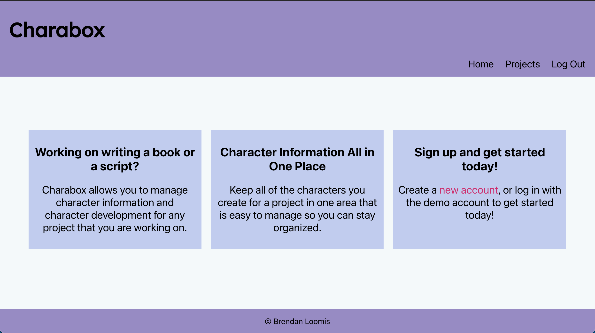
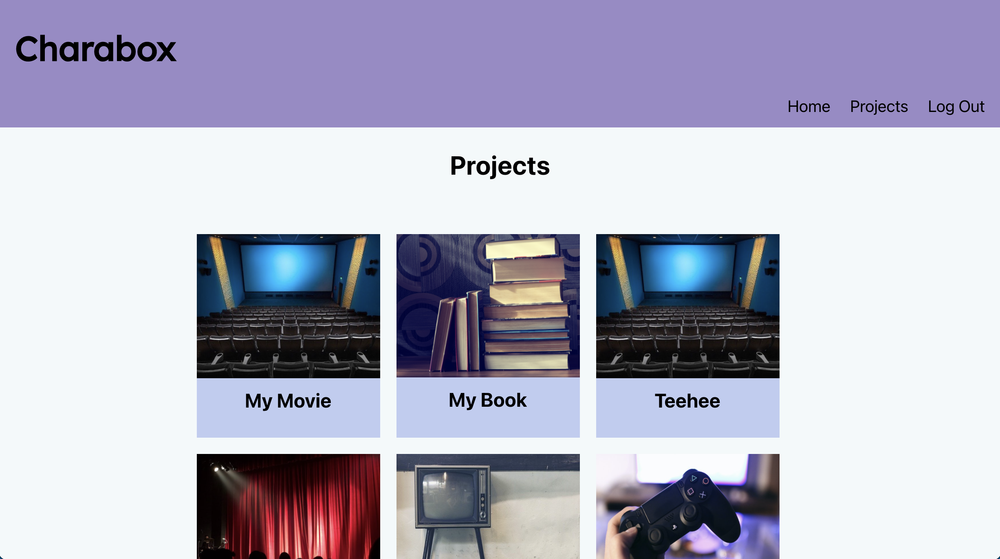
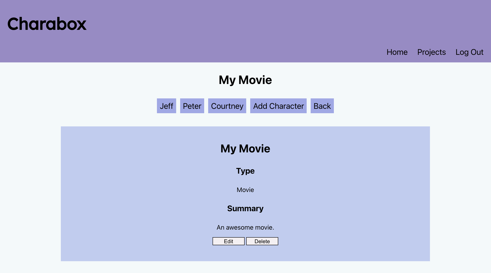
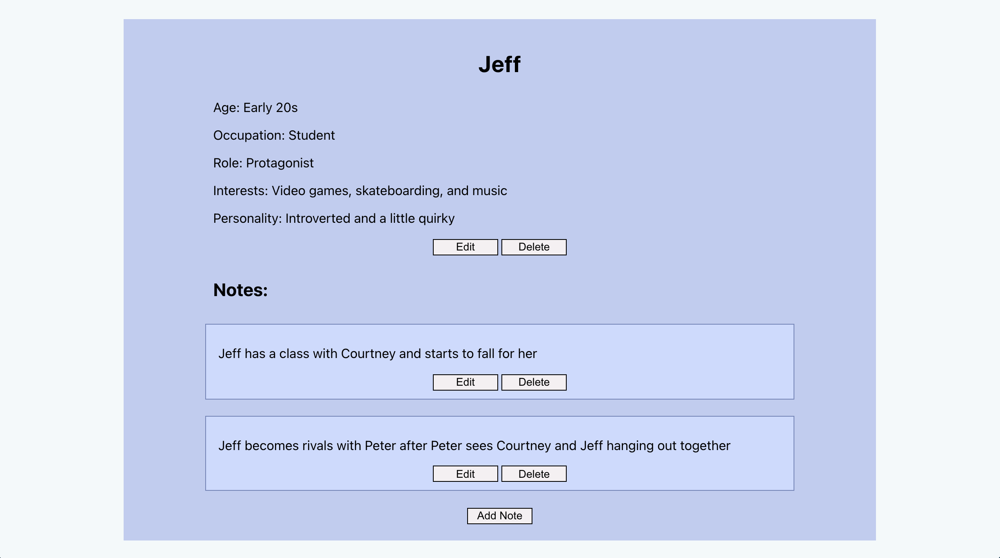
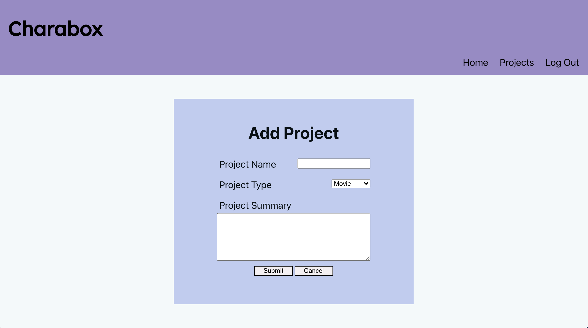
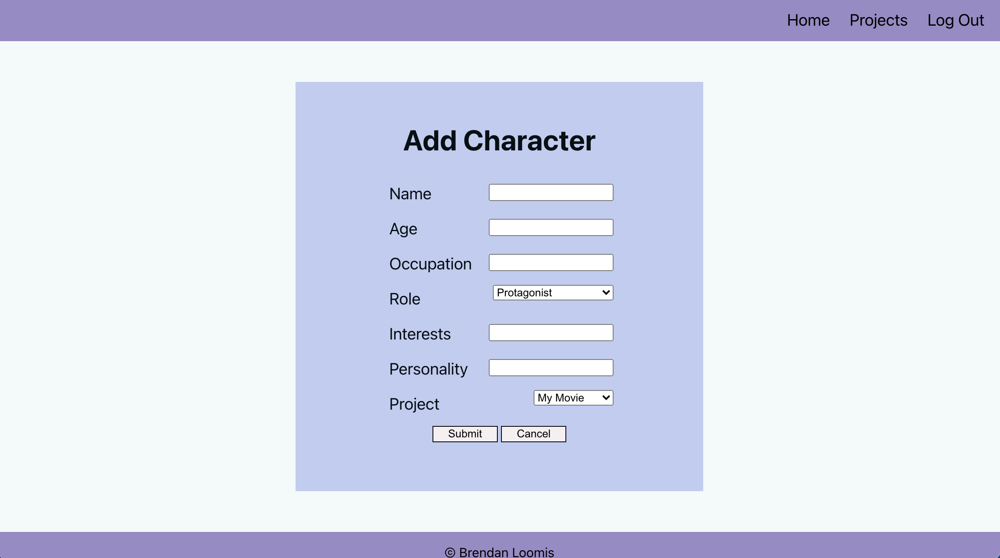
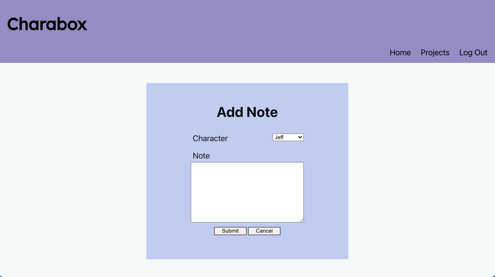

# Charabox
https://charabox.vercel.app/

An app that you can use to keep track of your character development for projects.

## API Documentation
https://github.com/brendanloomis/charabox-api

## Summary

Charabox is an application that can be used for creative writers to keep track of the character development for their projects. Users can add projects, characters to the projects, and notes for the characters. Users can also edit the information for their projects, characters, and notes. There is a demo account that can be used to try the app out (username: demo, password: pass123word).

## Screenshots
Landing Page:

Projects Page:

Project Overview Page:

Character Page:

Add Project Page:

Add Character Page:

Add Note Page:

## Technology Used
* Front-End:
    * React
    * JavaScript
    * HTML
    * CSS
    * Jest
    * Deployed with Vercel

* Back-End:
    * Node
    * Express
    * PostgreSQL
    * Mocha
    * Chai
    * Supertest
    * Deployed with Heroku